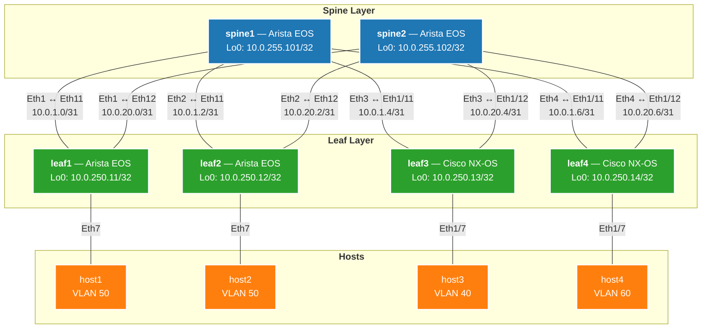
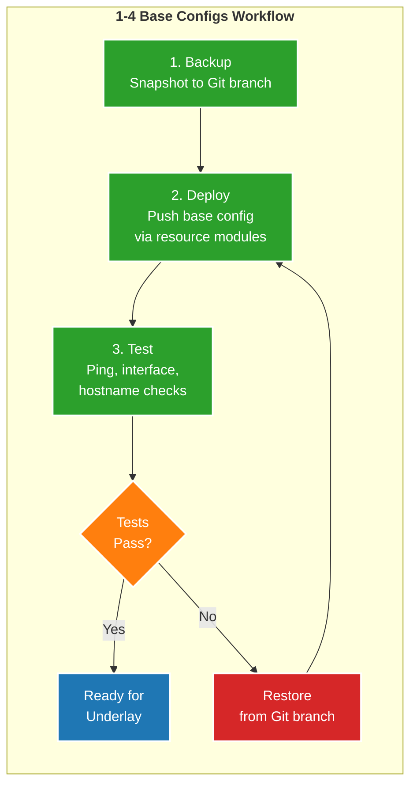
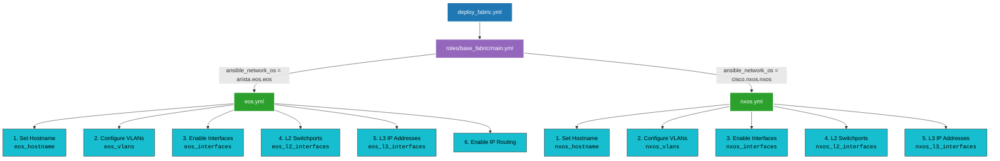

# Base Configuration — Spine-Leaf Fabric Foundation

## Fabric Topology

## VLANs (Configured on All Leafs)

| VLAN | Name           | Purpose                              |
|------|----------------|--------------------------------------|
| 40   | Data_VLAN_40   | Host data (leaf1, leaf3)             |
| 50   | Data_VLAN_50   | Host data (leaf2)                    |
| 60   | Data_VLAN_60   | Host data (leaf4)                    |
| 101  | L3VNI_Transit  | VXLAN L3 VNI transit (used by overlay) |

## Workflow: Backup → Deploy → Test

## Base Fabric Role — Dispatch Pattern

## Point-to-Point Link Addressing

### Spine1 Links (10.0.1.x/31)

| Spine1 Interface | Spine1 IP  | Leaf Interface | Leaf IP   | Leaf   |
|------------------|-----------|----------------|-----------|--------|
| Ethernet1        | 10.0.1.0  | Eth11          | 10.0.1.1  | leaf1  |
| Ethernet2        | 10.0.1.2  | Eth11          | 10.0.1.3  | leaf2  |
| Ethernet3        | 10.0.1.4  | Eth1/11        | 10.0.1.5  | leaf3  |
| Ethernet4        | 10.0.1.6  | Eth1/11        | 10.0.1.7  | leaf4  |

### Spine2 Links (10.0.20.x/31)

| Spine2 Interface | Spine2 IP  | Leaf Interface | Leaf IP    | Leaf   |
|------------------|-----------|----------------|------------|--------|
| Ethernet1        | 10.0.20.0 | Eth12          | 10.0.20.1  | leaf1  |
| Ethernet2        | 10.0.20.2 | Eth12          | 10.0.20.3  | leaf2  |
| Ethernet3        | 10.0.20.4 | Eth1/12        | 10.0.20.5  | leaf3  |
| Ethernet4        | 10.0.20.6 | Eth1/12        | 10.0.20.7  | leaf4  |
