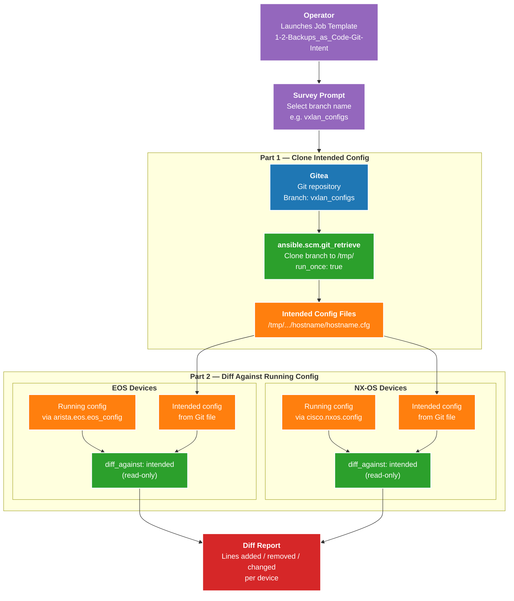
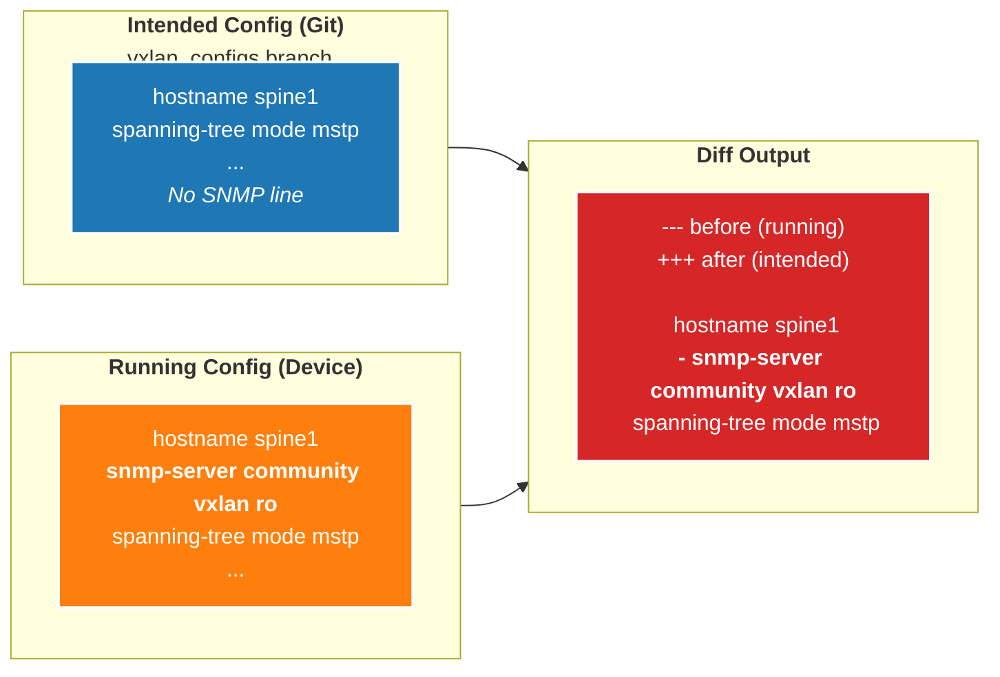
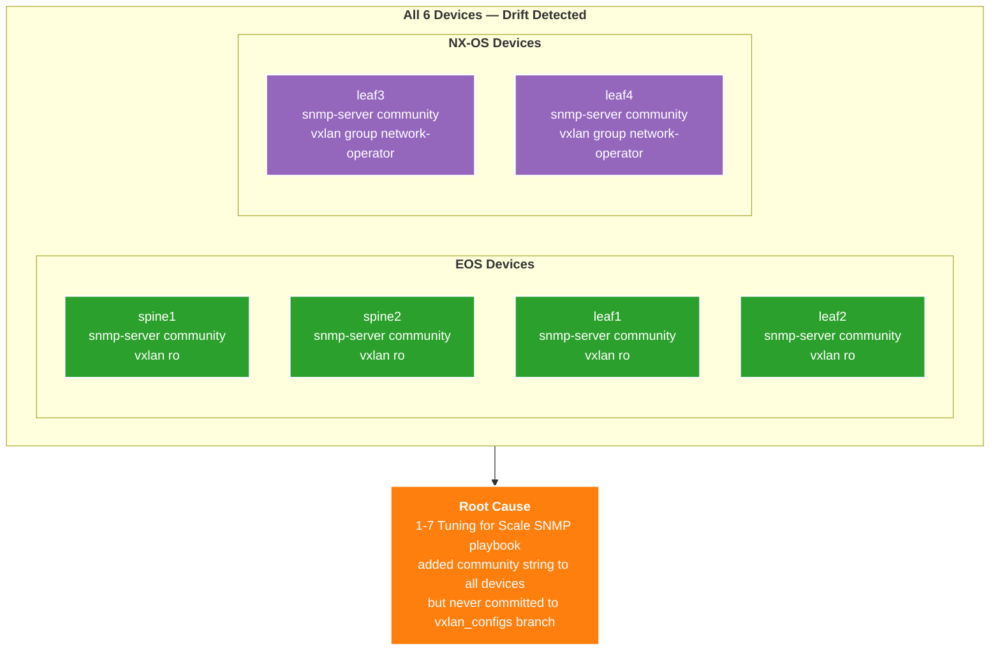
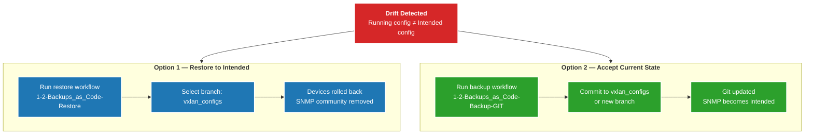
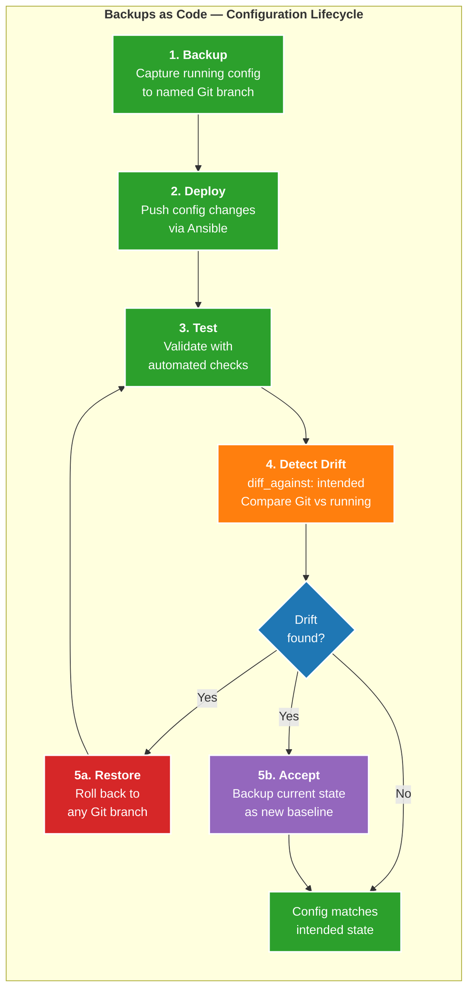
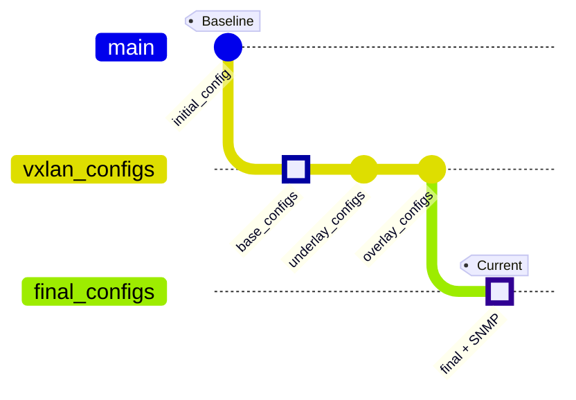
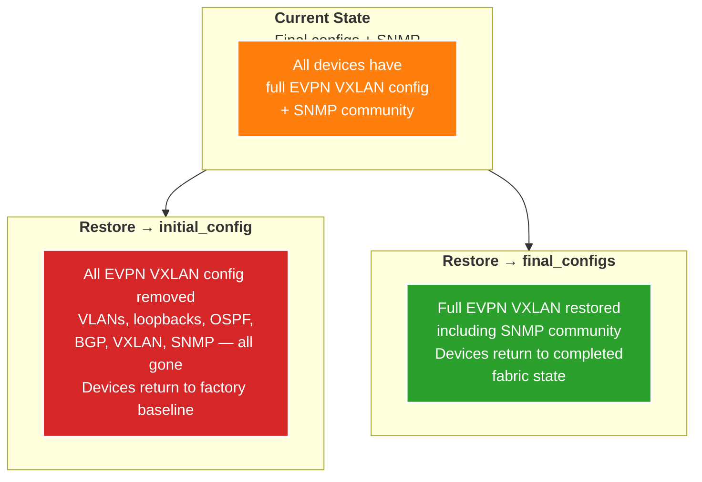

# Configuration Drift and Restore — Intended Config Diff

## Intended Config Diff — How It Works

## Drift Detection — SNMP Example

## Drift Per Device — Lab Results

## Remediation Options

## Full Backup-Restore Lifecycle

## Git Branch Timeline

## Restore Scenarios — Lab Walkthrough

