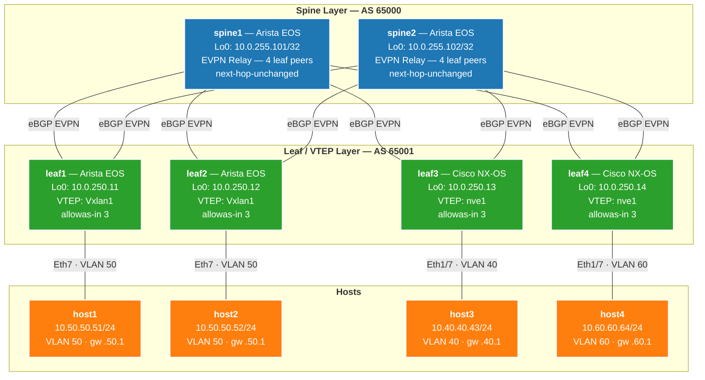
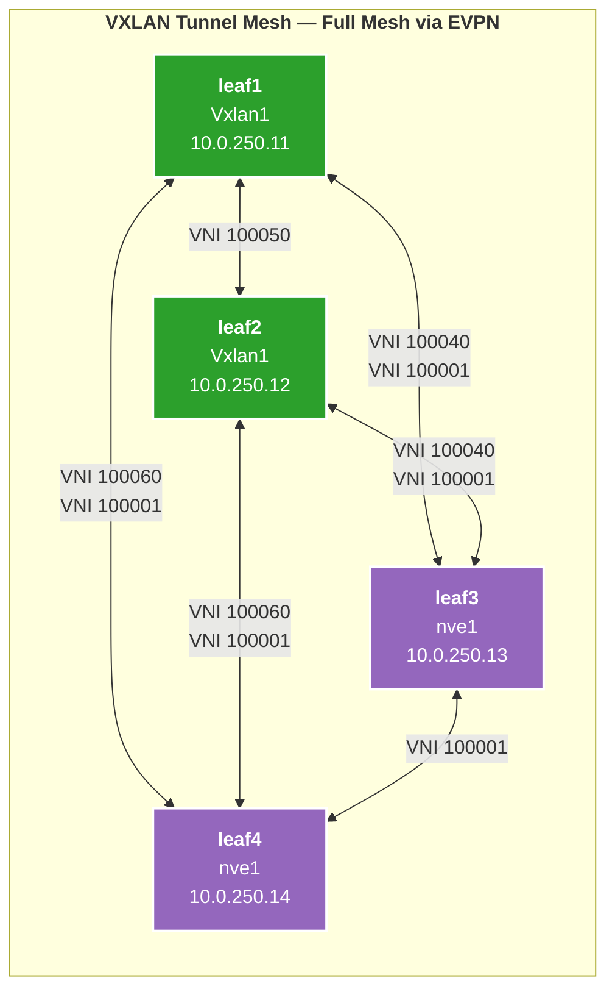
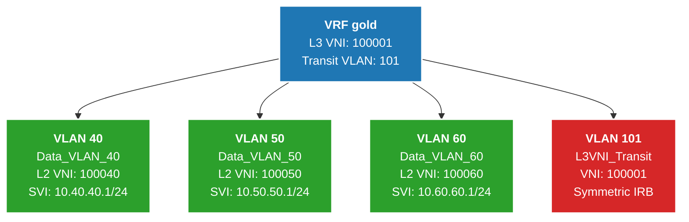
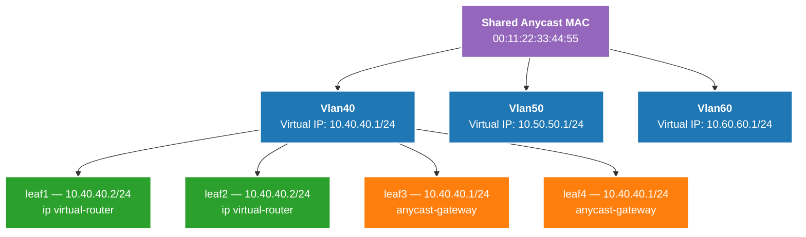
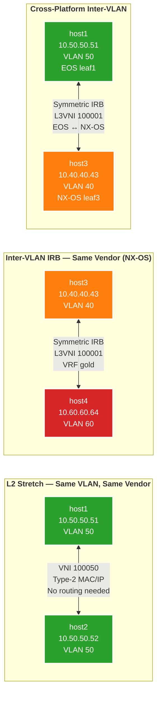
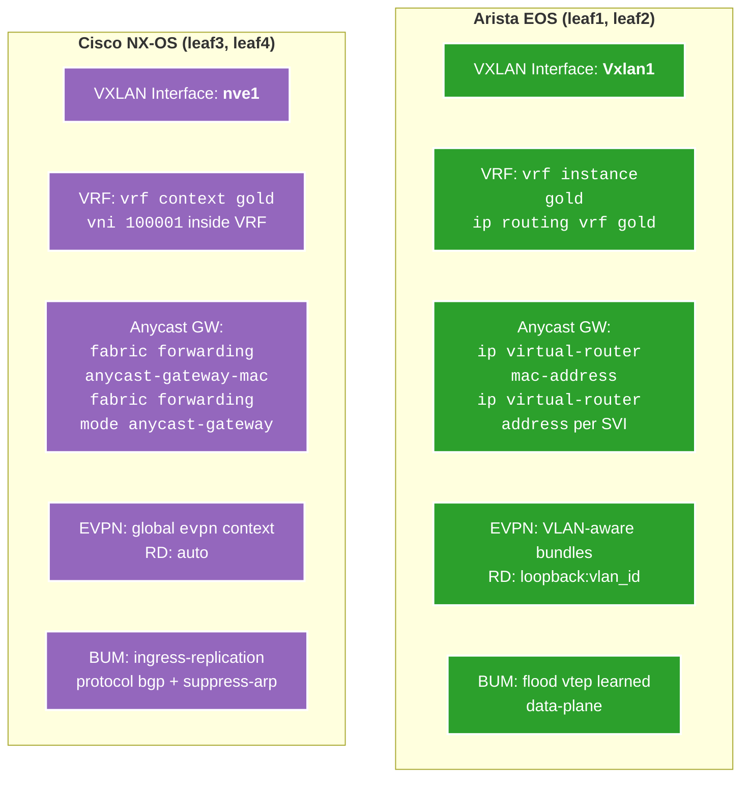

# Overlay Configuration — EVPN VXLAN Fabric

## EVPN BGP Overlay Topology

## VXLAN Tunnel Mesh

## VRF and Tenant Design

## Anycast Gateway

## Overlay Test Scenarios

## Symmetric IRB Packet Walk (host1 → host3)

```mermaid
flowchart LR
    H1["<b>host1</b><br>10.50.50.51<br>dst: 10.40.40.43"]
    L1["<b>leaf1 (EOS)</b><br>Ingress VTEP"]
    S["<b>Spine</b><br>IP Forward"]
    L3["<b>leaf3 (NX-OS)</b><br>Egress VTEP"]
    H3["<b>host3</b><br>10.40.40.43"]

    H1 -->|"1. Frame to<br>gw 10.50.50.1"| L1
    L1 -->|"2. Route in VRF gold<br>VLAN 50 SVI → L3VNI<br>Encap VNI 100001<br>dst VTEP 10.0.250.13"| S
    S -->|"3. IP forward<br>to leaf3 Lo0"| L3
    L3 -->|"4. Decap L3VNI<br>Route → VLAN 40 SVI<br>Forward to host3"| H3

    classDef host fill:#ff7f0e,stroke:#fff,stroke-width:2px,color:#fff
    classDef eos fill:#2ca02c,stroke:#fff,stroke-width:2px,color:#fff
    classDef nxos fill:#9467bd,stroke:#fff,stroke-width:2px,color:#fff
    classDef spine fill:#1f77b4,stroke:#fff,stroke-width:2px,color:#fff
    class H1,H3 host
    class L1 eos
    class L3 nxos
    class S spine
```

## Platform Comparison — EOS vs NX-OS

## VLAN-to-VNI Mapping

| VLAN | Name           | L2 VNI  | RT (Import/Export) | Purpose                     |
|------|----------------|---------|--------------------|-----------------------------|
| 40   | Data_VLAN_40   | 100040  | 1:100040           | Host data connectivity      |
| 50   | Data_VLAN_50   | 100050  | 1:100050           | Host data connectivity      |
| 60   | Data_VLAN_60   | 100060  | 1:100060           | Host data connectivity      |
| 101  | L3VNI_Transit  | 100001  | 1:100001           | Symmetric IRB (VRF `gold`)  |

## VTEP Addressing

| Device | Platform   | Loopback0 (VTEP Source) | VXLAN Interface | UDP Port |
|--------|------------|-------------------------|-----------------|----------|
| leaf1  | Arista EOS | 10.0.250.11/32          | Vxlan1          | 4789     |
| leaf2  | Arista EOS | 10.0.250.12/32          | Vxlan1          | 4789     |
| leaf3  | Cisco NX-OS| 10.0.250.13/32          | nve1            | 4789     |
| leaf4  | Cisco NX-OS| 10.0.250.14/32          | nve1            | 4789     |

## Anycast Gateway Addresses

| SVI    | Virtual Gateway IP | Anycast MAC        |
|--------|--------------------|--------------------|
| Vlan40 | 10.40.40.1/24      | 00:11:22:33:44:55  |
| Vlan50 | 10.50.50.1/24      | 00:11:22:33:44:55  |
| Vlan60 | 10.60.60.1/24      | 00:11:22:33:44:55  |

## Host-to-Leaf Connectivity

| Host  | Leaf          | Interface | VLAN | Host IP        | Default Gateway |
|-------|---------------|-----------|------|----------------|-----------------|
| host1 | leaf1 (EOS)   | Eth7      | 50   | 10.50.50.51/24 | 10.50.50.1      |
| host2 | leaf2 (EOS)   | Eth7      | 50   | 10.50.50.52/24 | 10.50.50.1      |
| host3 | leaf3 (NX-OS) | Eth1/7    | 40   | 10.40.40.43/24 | 10.40.40.1      |
| host4 | leaf4 (NX-OS) | Eth1/7    | 60   | 10.60.60.64/24 | 10.60.60.1      |

## PIM Multicast

| Setting            | Value                              |
|--------------------|------------------------------------|
| RP Address         | 10.0.255.254 (anycast)             |
| NX-OS Anycast RP   | Peers: 10.0.250.13, 10.0.250.14   |
| EOS PIM Interfaces | Ethernet11, Ethernet12             |
| NX-OS PIM Interfaces | Eth1/11, Eth1/12, Lo0, Vlan101  |
