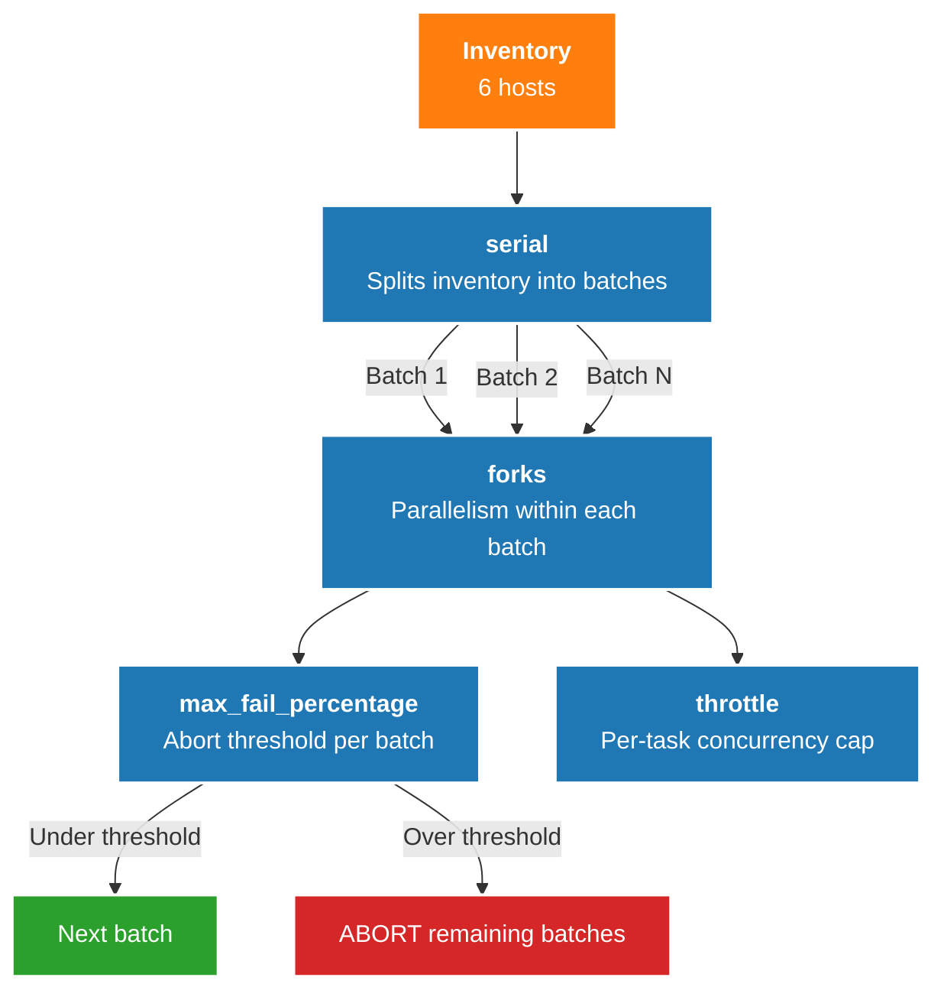
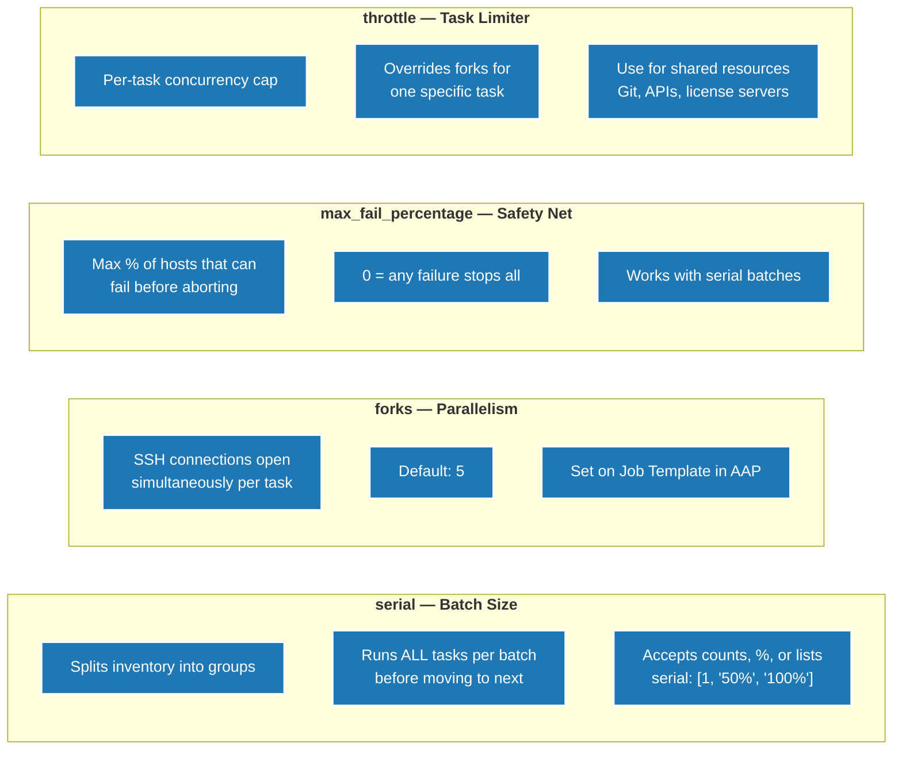
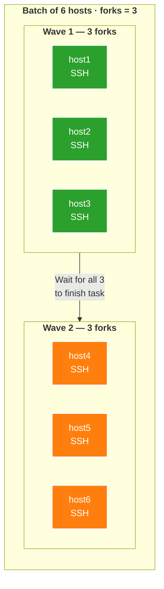
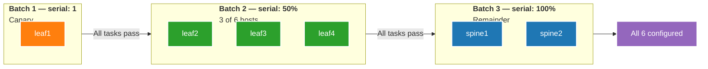
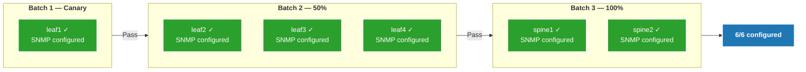
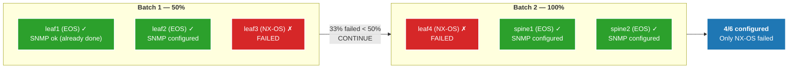
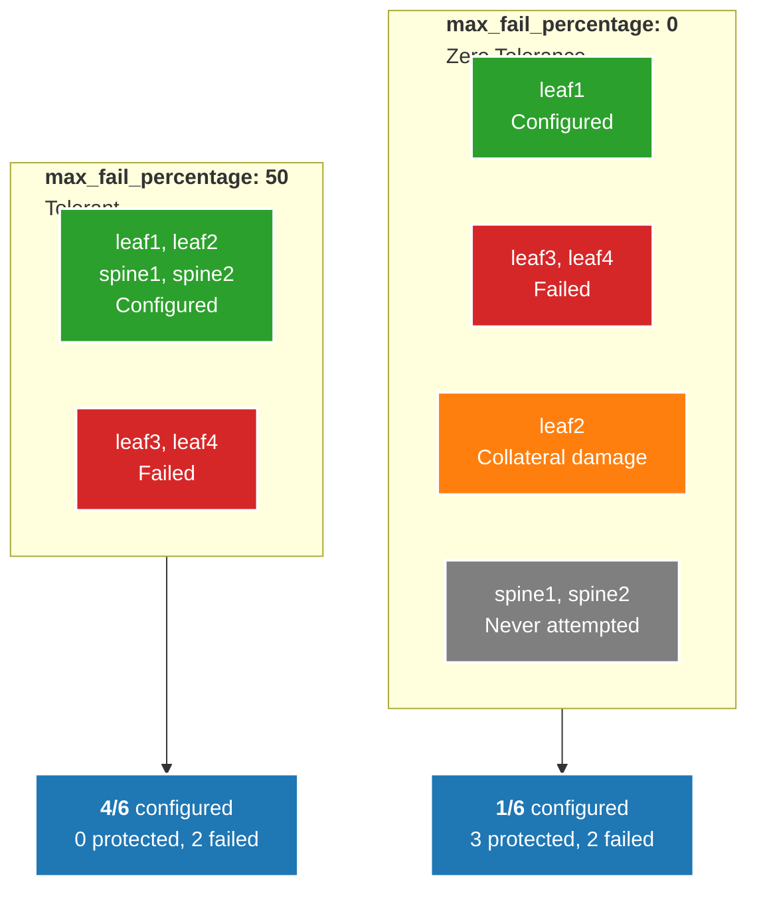
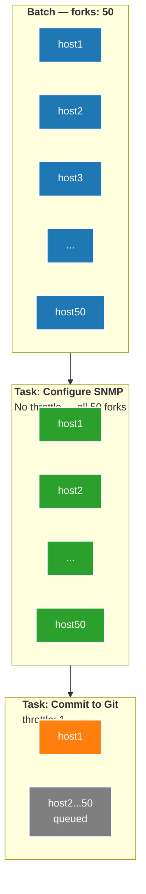
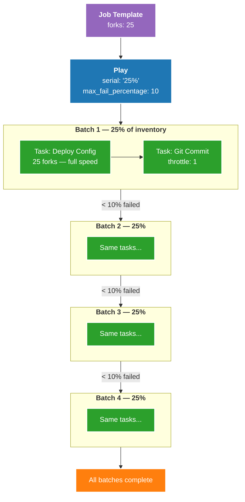

# Tuning for Scale — Forks, Serial, max_fail_percentage

## How the Controls Layer Together

## What Each Setting Controls

## Forks — Parallel Execution Within a Batch

## Serial — Canary Deployment Pattern

## Run 1 — No Error (max_fail: 0)

## Run 2 — Error + max_fail_percentage: 0 (Zero Tolerance)

```mermaid
flowchart LR
    subgraph B1 ["<b>Batch 1 — Canary</b>"]
        L1["leaf1 (EOS) ✓<br>SNMP configured"]
    end

    subgraph B2 ["<b>Batch 2 — 50%</b>"]
        L2["leaf2 (EOS)<br>Skipped error task<br>but ABORTED before SNMP"]
        L3["leaf3 (NX-OS) ✗<br>FAILED"]
        L4["leaf4 (NX-OS) ✗<br>FAILED"]
    end

    subgraph B3 ["<b>Batch 3 — 100%</b>"]
        SP1["spine1<br>NEVER RUN"]
        SP2["spine2<br>NEVER RUN"]
    end

    B1 -->|"Pass"| B2
    B2 -->|"67% failed > 0%<br>ABORT"| STOP["PLAY ABORTED"]
    STOP -.->|"Batch 3 skipped"| B3

    classDef pass fill:#2ca02c,stroke:#fff,stroke-width:2px,color:#fff
    classDef fail fill:#d62728,stroke:#fff,stroke-width:2px,color:#fff
    classDef collateral fill:#ff7f0e,stroke:#fff,stroke-width:2px,color:#fff
    classDef protected fill:#7f7f7f,stroke:#fff,stroke-width:2px,color:#fff
    classDef abort fill:#d62728,stroke:#fff,stroke-width:3px,color:#fff
    class L1 pass
    class L3,L4 fail
    class L2 collateral
    class SP1,SP2 protected
    class STOP abort
```

## Run 3 — Error + max_fail_percentage: 50 (Tolerant)

## Impact Comparison — 0% vs 50% Tolerance

## Throttle — Protecting Shared Resources

## Production Example — Layered Controls

